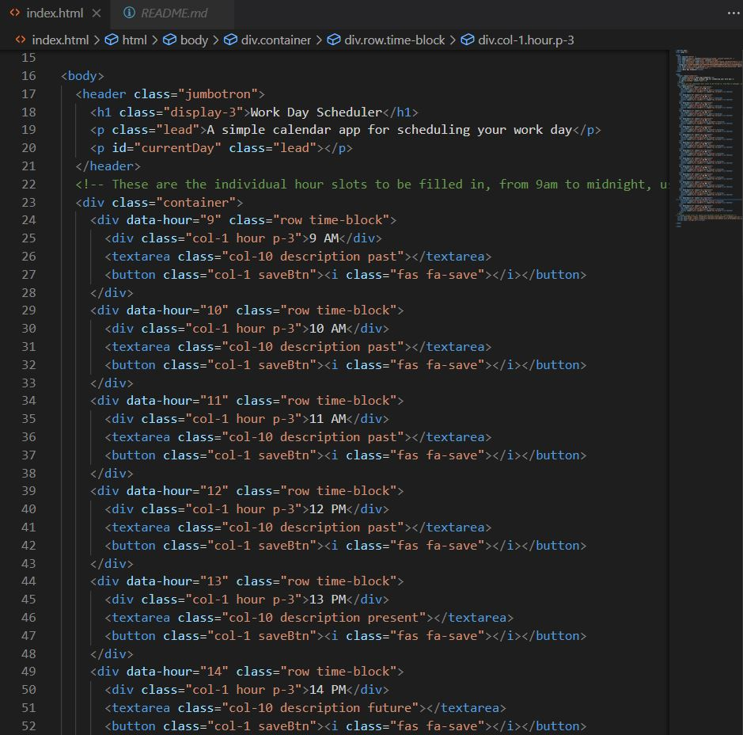
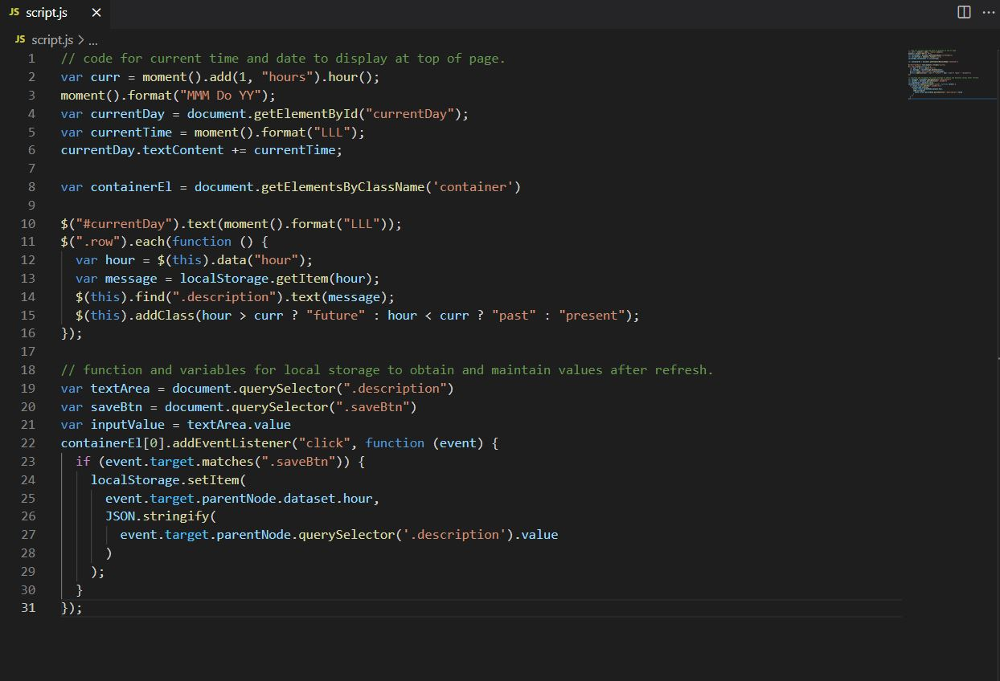
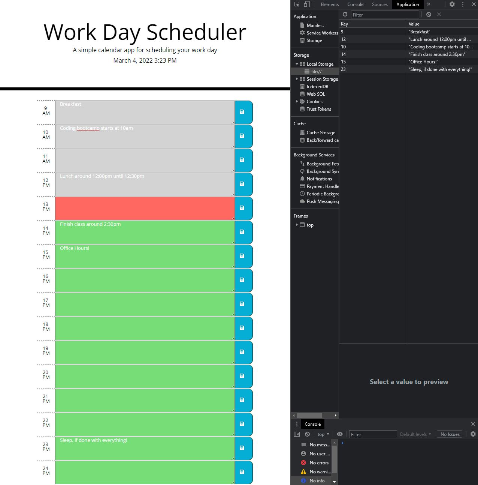

# Workday-Calendar

## DESCRIPTION

This planner is designed to keep track of an average workday, each time slot has an individual input field that saves to local storage when the save button is clicked. Values are maintained until local storage is cleared. 

## TECHNOLOGY

The planner was designed using an HTML file to achieve the basic layout, with a .css file taking care of the overall look. Finally a script file was used to acieve the local storage and timer functionality observed withing the planner.

## LOOK AND FEEL

### Example of html code for Planner:

### Example of script file for Planner:

### Example of deployed Planner:

